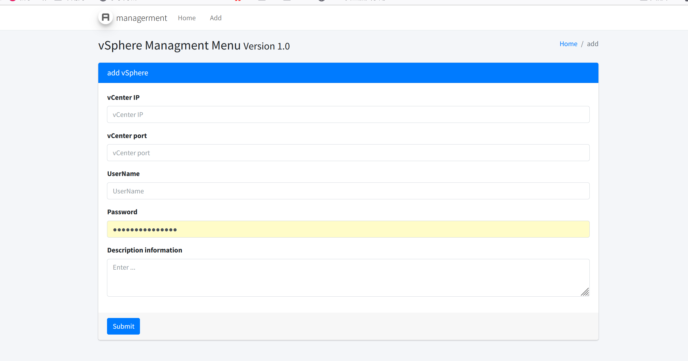
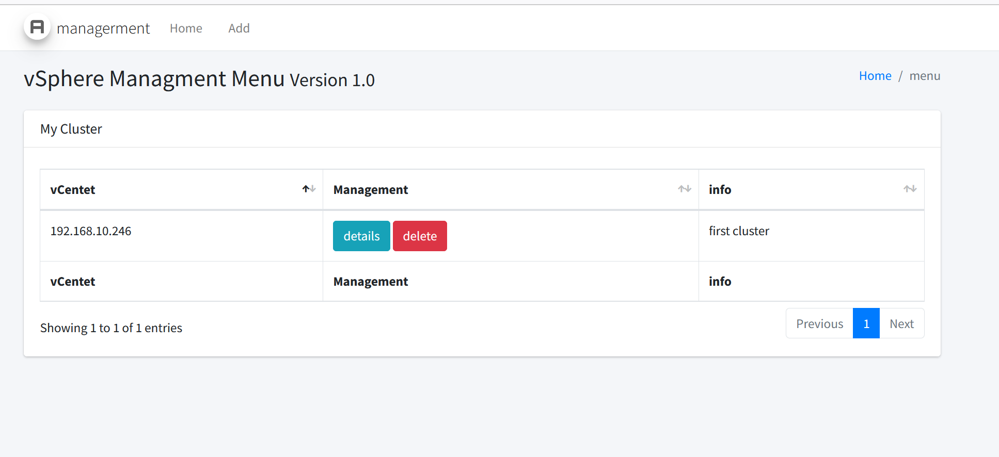
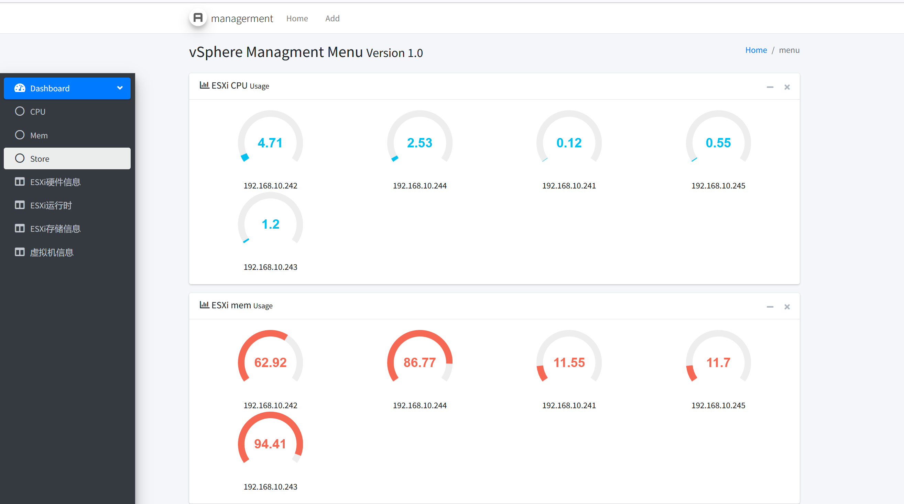

### 它是什么？

一个支持对多套vsphere集群进行资源可视化的平台。

### 它能做什么？

支持对多套vsphere进行数据采集，并以webui方式展示其资源信息，提供了便捷的巡检方式。

### 项目展示





vSphere集群信息：



#### 组件

adminlet

flask

python3.8.5

### 如何使用它？

#### 以容器方式启动

已经将工具封装成镜像，并上传到dockerhub，只需要pull将镜像拉取到本地：

```bash
docker pull wt1611/vmware_vsphere:v1.0
```

将容器内部的5000端口暴露出来：

```bash
 docker run -d -p 5000:5000 wt1611/vmware_vsphere:v1.0
```

访问：

http://\<ip\>:5000

#### 直接启动

直接启动涉及到python包导入的问题：

本项目由python3.8.5开发，所以建议使用该版本

```bash
cd project/
pip3 install -r requirements.txt
```

包导入完成后:

```bash
python3 begin.py
```

访问：

http://\<ip\>:5000
